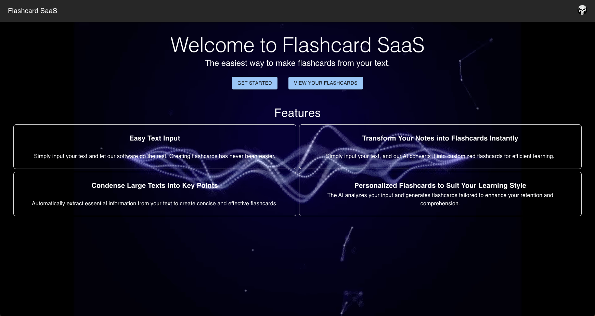

# AI-Powered Flashcards App

## Project Overview

This project is an AI-powered Flashcards app.



## 🌟 Features

- Real-time inventory tracking
- AI-powered image recognition for adding items
- Smart recipe suggestions based on available ingredients
- Dark mode for comfortable viewing
- Search functionality for quick item lookup
- Responsive design for various screen sizes

## 🛠️ Technologies Used

- [Next.js](https://nextjs.org/)
- [React](https://reactjs.org/)
- [Firebase](https://firebase.google.com/)
- [OpenAI API](https://openai.com/api/)
- [OpenRouter API](https://openrouter.ai/docs/quick-start)
- [Material-UI](https://material-ui.com/)

## 🚀 Live Demo

Check out the live demo deployed on Vercel: [\[Click Here!\]]()

## 🏁 Getting Started

To get a local copy up and running, follow these steps:

1. Clone the repository:


```bash
git clone https://github.com/nehalpatil7/flashcard-saas.git
```

2. Navigate to the project directory:

```bash
cd flashcards-saas
```

3. Install dependencies:
```bash
npm install
```

4. Set up environment variables:
Create a `.env.local` file in the root directory of your project & add the following environment variables:

```bash
NEXT_PUBLIC_OPENROUTER_ENDPOINT=your_openrouter_endpoint
OPENROUTER_API_KEY=your_openrouter_api_key

FIREBASE_API_KEY=your_firebase_api_key
NEXT_PUBLIC_FIREBASE_AUTH_DOMAIN=your_firebase_auth_domain
NEXT_PUBLIC_FIREBASE_PROJECT_ID=your_firebase_project_id
NEXT_PUBLIC_FIREBASE_STORAGE_BUCKET_NAME=your_firebase_storage_bucket
FIREBASE_MESSAGING_SENDER_ID=your_firebase_messaging_sender_id
FIREBASE_APP_ID=your_firebase_app_id
FIREBASE_MEASUREMENT_ID=your_firebase_measurement_id
NEXT_PUBLIC_STRIPE_PUBLIC_KEY=your_stripe_publishable_key
STRIPE_SECRET_KEY=your_stripe_secret_key
NEXT_PUBLIC_CLERK_PUBLISHABLE_KEY=your_clerk_public_key
CLERK_SECRET_KEY=your_clerk_secret_key
```


Replace the placeholder values (`your_firebase_api_key`, `your_stripe_secret_key`, etc.) with your actual Firebase and OpenRouter credentials.

To set up your Firebase project and obtain these credentials:
i. Go to the [Firebase Console](https://console.firebase.google.com/)
ii. Click on "Add project" or select an existing project
iii. Follow the setup wizard to create your project
iv. Once your project is ready, click on the web icon (`</>`) to add a web app to your project
v. Register your app and Firebase will provide you with the configuration object containing these values

For the OpenAI API key, sign up at the [OpenAI website](https://openai.com/api/) to get your API key.


5. Run the development server:

```bash
npm run dev
```

6. Open [http://localhost:3000](http://localhost:3000) with your browser to see the result.

## 🐛 Troubleshooting

If you encounter any issues while setting up or running the project, try the following:

1. Ensure all dependencies are installed:
```bash
npm install
```

2. Clear Next.js cache:
```bash
rm -rf .next
```

3. Rebuild the project:
```bash
npm run build
```

4. For OpenAI API issues, verify that your API key is correctly set in the `.env.local` file and that you have sufficient credits in your OpenAI account.


## 👤 Author

**Nehal Patil**

- LinkedIn: [Nehal Patil](https://www.linkedin.com/in/nehalpatil7/)
- GitHub: [@nehalpatil7](https://github.com/nehalpatil7)

## 🙏 Acknowledgments

- Headstarter AI Fellowship for the opportunity and support
- OpenAI for providing the powerful API
- All contributors and reviewers
